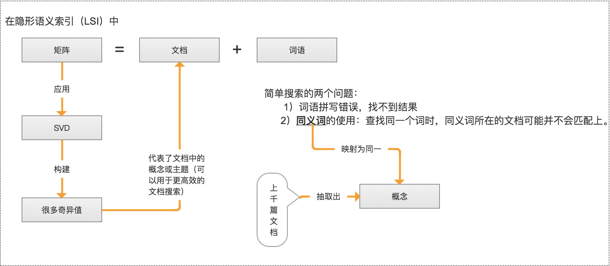

# 章节内容：
* SVD矩阵分解
* 推荐引擎
* 利用SVD提示推荐引擎的性能

# 1. SVD 的应用：隐性语义索引（LSI）和推荐系统。
* 奇异值分解（SVD）：提取信息的方法。可以把SVD看成是从噪声数据中抽取相关特征。
* 优点：简化数据，去除噪声，提高算法的结果。
* 缺点：数据的转换可能难以理解。
* 使用的数据类型：数值型数据。

# 补充：降维
* 降维（dimensionality reduction）
* 如果样本数据的特征维度很大，会使得难以分析和理解。我们可以通过降维技术减少维度。
* 降维技术并不是将影响少的特征去掉，而是将样本数据集转换成一个低维度的数据集。

# 1.1 隐性语义索引：矩阵 = 文档 + 词语
* 是最早的SVD应用之一。我们称利用SVD的方法为隐性语义索引（LSI）或隐性语义分析（LSA）。
* 

# 2. 矩阵分解
* SVD 是矩阵分解的一种类型，而矩阵分解是将数据矩阵分解为多个独立部分的过程。
* 矩阵分解可以将原始矩阵表示成新的易于处理的形式，这种新形式时两个或多个矩阵的乘积。（类似代数中的因数分解）

* 举例：如何将12分解成两个数的乘积？（1，12）、（2，6）、（3，4）都是合理的答案。

# SVD 时矩阵最常见的分解技术。
* SVD将原始的数据集矩阵Data分解成三个矩阵U、∑、VT。
* 举例：如果原始矩阵Data是m行n列，那么U、∑、VT 就分别是m行m列、m行n列和n行n列。
* 
* 物品对越相似，它们的相似度值就越大。

# 2）皮尔逊相关系数：度量的是两个向量之间的相似度。
* 相对欧氏距离的优势：它对用户评级的量级并不敏感。
* 皮尔逊相关系数的取值范围从 -1 到 +1，通过函数0.5 + 0.5*corrcoef()这个函数计算，把值归一化到0到1之间。

# 3）余弦相似度：计算的是两个向量夹角的余弦值。
* 如果夹角为90度，则相似度为0；如果两个向量的方向相同，则相似度为1.0。
* 余弦相似度的取值范围也在-1到+1之间。
* ：推荐引擎评价的指标，先计算均方误差然后取其平方根。

# 5. 示例：（看代码）
# 5.1 推荐未尝过的菜肴
* 1）寻找用户没有评级的菜肴，即在用户-物品矩阵中的0值；
* 2）在用户没有评级的所有物品中，对每个物品预计一个可能的评级分数。这就是说，我们认为用户可能会对物品的打分（这个就是相似度计算的初衷）
* 3）对这些物品的评分从高到低进行排序，返回前N个物品。

# 5.2 利用SVD提高推荐效果
* 将矩阵降维

# 5.3  构建推荐引擎面临的挑战
* 1）在大规模的数据集上，SVD分解会降低程序的速度
* 2）存在其他很多规模扩展性的挑战性问题，比如矩阵的表示方法和计算相似度得分消耗资源。
* 3）如何在缺乏数据时给出好的推荐（冷启动问题，解决方案就是将推荐看成是搜索问题）