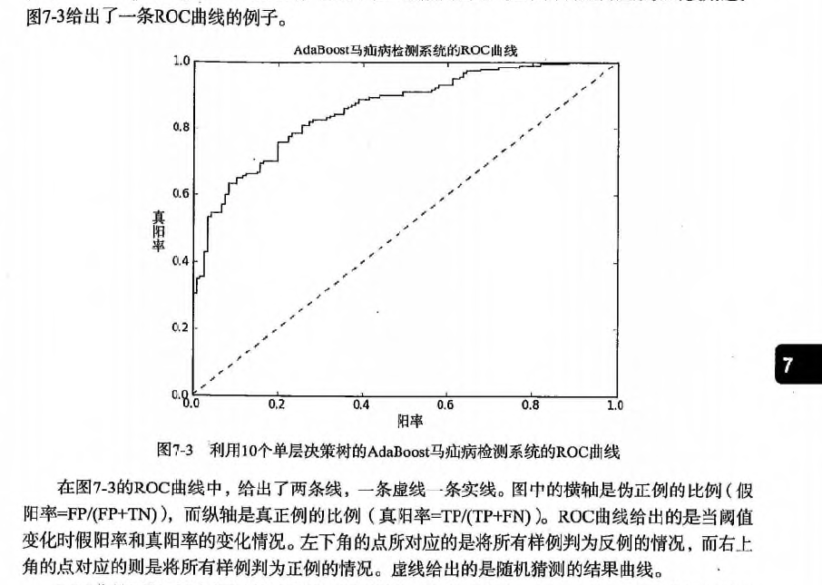
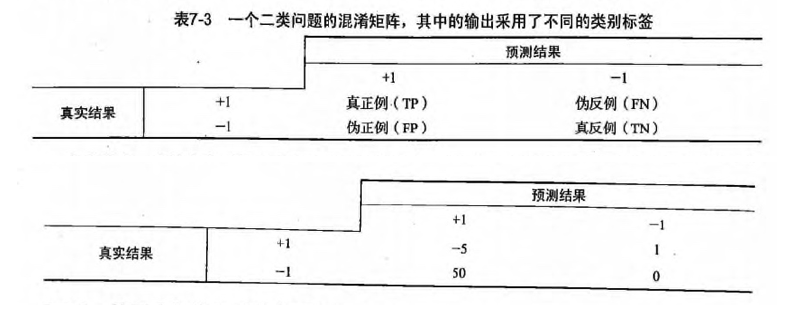

# 7) 利用AdaBoost元算法提高分类

* 元算法(meta-algorithm) 或 集成方法(ensemble method)
    * 概念：是对其他算法进行组合的一种形式。
    * 通俗来说： 当做重要决定时，大家可能都会考虑吸取多个专家而不只是一个人的意见。
        机器学习处理问题时又何尝不是如此？ 这就是元算法(meta-algorithm)背后的思想。
* AdaBoost(adaptive boosting: 自适应boosting)
    * 能否使用弱分类器和多个实例来构建一个强分类器？ 这是一个非常有趣的理论问题。
    * 优点：泛化错误率低，易编码，可以应用在大部分分类器上，无参数调节。
    * 缺点：对离群点敏感。
    * 适用数据类型：数值型和标称型数据。
* bagging：基于数据随机重抽样的分类起构造方法
    * 自举汇聚法(bootstrap aggregating)，也称为bagging方法，是在从原始数据集选择S次后得到S个新数据集的一种技术。
    * 1. 新数据集和原数据集的大小相等。
    * 2. 每个数据集都是通过在原始数据集中随机选择一个样本来进行替换(替换：意味着可以多次选择同一个样本，也就有重复值)而得到的。
    * 3. 该算法作用的数据集就会得到S个分类器，与此同时，选择分类器投票结果中最多的类别作为最后的分类结果。
    * 4. 例如：随即森林(random forest)
* boosting
    * boosting是一种与bagging很类似的技术。不论是boosting还是bagging当中，所使用的多个分类器的类型都是一致的。
    * 区别是什么？
    * 1. bagging：不同的分类器是通过串形训练而获得的，每个新分类器斗根据已训练出的分类器的性能来进行训练。
    * 2. boosting：是通过集中关注被已有分类器错分的那些数据来获得新的分类器。
    * 3. 由于boosting分类的结果是基于所有分类器的加权求和结果的，因此boosting与bagging不太一样。
    * 4. bagging中的分类器权重是相等的，而boosting中的分类器权重并不相等，每个权重代表的是其对应分类器在上一轮迭代中的成功度。
    * 目前boosting方法最流行的版本是： AdaBoost。
* AdaBoost的一般流程
    * 训练算法： 基于错误提升分类器的性能
    * 基于单层决策树构建弱分类器
        * 单层决策树(decision stump, 也称决策树桩)是一种简单的决策树。
    * 过拟合(overfitting, 也称为过学习)
        * 发现测试错误率在达到一个最小值之后有开始上升，这种现象称为过拟合。
    * 
* 非均衡分类问题
    * 现象：
        * 判断马是否能继续生存
        * 过滤垃圾邮件
    * ROC曲线: 最佳的分类器应该尽可能地处于左上角
    * 
        * 对不同的ROC曲线进行比较的一个指标是曲线下的面积(Area Unser the Curve, AUC). 
        * AUC给出的是分类器的平均性能值，当然它并不能完全代替对整条曲线的观察。
        * 一个完美分类器的AUC为1，而随机猜测的AUC则为0.5。
    * 基于代价函数的分类器决策控制：`TP*(-5)+FN*1+FP*50+TN*0`
    * 
    * 过欠抽样(undersampling)或者过抽样(oversampling)
        * 过欠抽样: 意味着复制样例(重复使用)
        * 过抽样: 意味着删除样例
