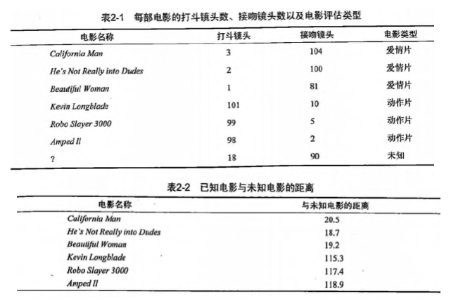
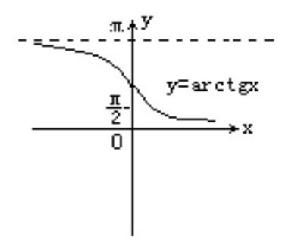

# 机器学习实战 - 复习版 - KNN

## 目录

0. 一句话总结
1. KNN 概述
2. KNN 场景
3. KNN 原理
4. KNN 项目案例
5. KNN 补充知识
6. KNN 小结
7. KNN 问题汇总

## 一句话总结

近朱者赤近墨者黑！ --- KNN 算法，新数据距离哪种分类的数据近（多数表决，少数服从多数），它就属于哪个分类。

## 1、概述

k-近邻（k-NearestNeighbor）算法是一种基本分类与回归方法。

k 近邻算法的输入为实例的特征向量，对应于特征空间的点；输出为实例的类别，可以取多类。k 近邻算法假设给定一个训练数据集，其中的实例类别已定。分类时，对新的实例，根据其 k 个最近邻的训练实例的类别，通过多数表决等方式进行预测。因此，k近邻算法不具有显式的学习过程（k-近邻算法没有训练算法的过程）。

k 近邻算法的三个基本要素：
* k值的选择
* 距离度量
* 分类决策规则

## 2、KNN 场景

根据电影中 `打斗次数` 和 `亲吻次数` 给电影按照题材分类，如下图：

上图说明：现在根据上面我们得到的样本集中所有电影与未知电影的距离，按照距离递增排序，可以找到 k 个距离最近的电影。
假定 k=3，则三个最靠近的电影依次是， He's Not Really into Dudes 、 Beautiful Woman 和 California Man。
knn 算法按照距离最近的三部电影的类型，决定未知电影的类型，而这三部电影全是爱情片，因此我们判定未知电影是爱情片。

## 3、KNN 原理

### 3.1、KNN 通俗理解

给定一个训练数据集，对新的输入实例，在训练数据集中找到与该实例最邻近的 k 个实例，这 k 个实例的多数属于某个类，就把该输入实例分为这个类。

### 3.2、KNN 工作原理

1. 假设有一个带有标签的样本数据集（训练样本集），其中包含每条数据与所属分类的对应关系。
2. 输入没有标签的新数据后，将新数据的每个特征与样本集中数据对应的特征进行比较。
    1. 计算新数据与样本数据集中每条数据的距离。
    2. 对求得的所有距离进行排序（从小到大，越小表示越相似）。
    3. 取前 k （k 一般小于等于 20 ）个样本数据对应的分类标签。
3. 求 k 个数据中出现次数最多的分类标签作为新数据的分类。

### 3.3、KNN 优缺点

优点：精度高、对异常值不敏感、无数据输入假定

缺点：计算复杂度高、空间复杂度高（因为每次新来一条数据都会计算新数据点与所有的训练数据集中的点的距离）

## 4、KNN 项目案例

### 4.1、项目案例1：优化约会网站的配对效果

* 文档位置：

<https://github.com/apachecn/MachineLearning/blob/python-2.7/docs/2.k-%E8%BF%91%E9%82%BB%E7%AE%97%E6%B3%95.md>
* 代码位置：

<https://github.com/apachecn/MachineLearning/blob/python-2.7/src/python/2.KNN/kNN.py>

### 4.2、项目案例2：构建自己的手写数字识别系统

* 文档位置：

<https://github.com/apachecn/MachineLearning/blob/python-2.7/docs/2.k-%E8%BF%91%E9%82%BB%E7%AE%97%E6%B3%95.md>
* 代码位置：

<https://github.com/apachecn/MachineLearning/blob/python-2.7/src/python/2.KNN/kNN.py>

## 5、补充知识

### 5.1、归一化（标准化）

* 定义：

    归一化就是让权重变为统一的过程。归一化特征值，消除特征之间量级不同导致的影响。

    归一化就是要把你需要处理的数据经过处理后（通过某种算法）限制在你需要的一定范围内。首先归一化是为了后面数据处理的方便，其次是保证程序运行时收敛加快。

* 归一化的一些常用方法：

1. 线性函数转换，表达式如下：

    

    说明：x、y 分别为转换前、后的值， MaxValue、MinValue 分别为样本的最大值和最小值。

2. 对数函数转换，表达式如下：

    

    说明：以 10 为底的对数函数转换。

3. 反余切函数转换，表达式如下：

    

    如图：
    
    

4. 可参考链接：
    
    https://www.zhihu.com/question/20455227
    http://www.cnblogs.com/Tisty/archive/2008/07/22/1248994.html
    https://www.douban.com/note/292590773/
    http://blog.csdn.net/acdreamers/article/details/44664205
    http://blog.csdn.net/qq_20823641/article/details/51345057

## 6、KNN 小结

### 6.1、k值的选择

* k 值的选择会对 k 近邻算法的结果产生重大的影响。
* 如果选择较小的 k 值，就相当于用较小的邻域中的训练实例进行预测，“学习”的近似误差（approximation error）会减小，只有与输入实例较近的（相似的）训练实例才会对预测结果起作用。但缺点是“学习”的估计误差（estimation error）会增大，预测结果会对近邻的实例点非常敏感。如果邻近的实例点恰巧是噪声，预测就会出错。换句话说，k 值的减小就意味着整体模型变得复杂，容易发生过拟合。
* 如果选择较大的 k 值，就相当于用较大的邻域中的训练实例进行预测。其优点是可以减少学习的估计误差。但缺点是学习的近似误差会增大。这时与输入实例较远的（不相似的）训练实例也会对预测起作用，使预测发生错误。 k 值的增大就意味着整体的模型变得简单。
* 近似误差和估计误差，请看这里：https://www.zhihu.com/question/60793482

### 6.2、距离的度量

* 特征空间中两个实例点的距离是两个实例点相似程度的反映。
* k 近邻模型的特征空间一般是 n 维实数向量空间  。使用的距离是欧氏距离，但也可以是其他距离，如更一般的  距离，或者 Minkowski 距离。

### 6.3、分类决策规则

* k 近邻算法中的分类决策规则往往是多数表决，即由输入实例的 k 个邻近的训练实例中的多数类决定输入实例的类。

## 7、问题汇总

* 谷德 2017-11-21 20:39:38  ===> 求距离还有其他的算法吗？

    解答：k 近邻模型的特征空间一般是 n 维实数向量空间  ，使用的距离是欧式距离。当然，我们还可以选择其他距离，比如更加一般的  距离（Lp distance），或者 Minkowski 距离（Minkowski distance），曼哈顿距离（Manhattan Distance），切比雪夫距离（Chebyshev Distance）。

    更多参见链接：http://liyonghui160com.iteye.com/blog/2084557

* ~~ 2017-11-21 20:41:07 ===> 用来求电影距离的 x y 具体含义是指什么？

    解答：如果大佬你说的是下面这种：
    
    

    那么求电影距离的 x 是对应的电影中的 打斗镜头数 ，而 y 对应的是接吻镜头数，都是指的数据的特征，可能这里写的不清楚，你可以把这里的 y 当成 x2 属性，而把之前的 x 当成 x1 属性，这样就容易理解多了。都是特征，只不过是对应的不同的特征。注意，这里的 y 代表的不是相应的分类。

    如果不是上面的这种，那么 x 代表的就是特征，y 代表的是目标变量，也就是相应的分类。

* 蓝色之旅 2017-11-21 20:41:22 ===> 可以讲pearson计算相似评价值度量吗？

    解答：Pearson 相关系数可以参考下面两个链接：
    * http://www.codeweblog.com/%E7%9B%B8%E4%BC%BC%E6%80%A7%E5%BA%A6%E9%87%8F-pearson%E7%9B%B8%E5%85%B3%E7%B3%BB%E6%95%B0/
    * https://www.cnblogs.com/yulinfeng/p/4508930.html

* QQ 2017-11-21 20:44:15 ===> 那这个算法优化点在 k 和 距离上？

    解答：对，但不全对。三个因素上都可以进行优化。
    * 比如 k 值的选择上，我们可以选择一个近似误差和估计误差都较好的一个 k 值。
    * 距离度量上，我们上面说有很多种的距离度量方式，具体问题具体对待，根据不同的数据我们选择不同的距离度量方式，也可以达到优化的效果。
    * 分类决策规则这方面，我们也可以根据自己的经验选择适合的分类决策规则，KNN 最常用的就是多数表决。
    * 补充一点，还可以进行优化的部分。可以给训练数据集中的数据点加上适合的权重，距离新数据点相对较近的，权重较大，较远的，权重相应减小。这样也可以算是一种优化吧。

* 谷德 2017-11-21 21:01:52 ===> 如果数据的维度很多（列有很多）的话，这个靠内存计算是不是就很快就爆了？

    解答：是的啊，也可能不会爆炸，但是会很慢。当然大佬问的时候说到，那 KNN 在实际应用中的意义何在？之前的巨人们也做了一些相应的优化，比如 kd-tree 和 ball-tree 这些，详细内容可以参见链接：https://www.zhihu.com/question/30957691 。如果你感觉仍然达不到你的需求，对最初的数据进行预处理，也是可以的，比如降维等，在实用算法之前进行一些必要的处理，这样也可以使 KNN 的效率提升。当然，如果还是不如你的预期，那就考虑一下换一个算法试试。

* QQ 2017-11-21 21:03:05 ===> 归一化算法的选取标准是什么？

    解答：归一化算法的选取标准可以参考下面两个链接：
    * https://www.zhihu.com/question/20455227
    * https://www.zhihu.com/question/26546711/answer/62085061  

* HY Serendipity 2017-11-21 21:25:18 ===> 手写数字识别的时候，img2vector 所以是看成了32·32个特征么？

    解答：这么理解稍微有一些偏颇。并不是将图片文件看成 32*32 个特征，而是将之前 32 行 32 列的数据转换成为一行数据，也就是 1 * 1024 的形式，把它当成一条数据来处理，一个图片代表一个样本数据，这样更便于我们接下来的欧式距离的计算。

